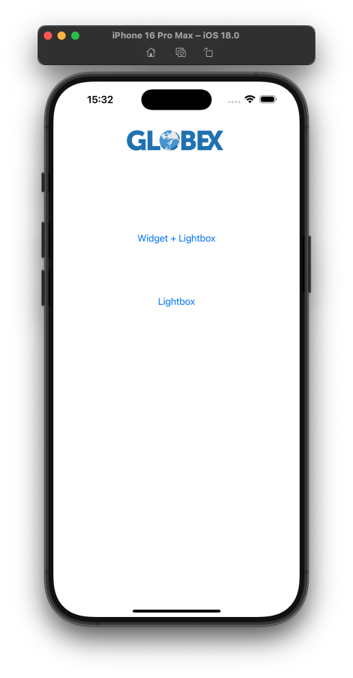

# Trustly Mobile Webview Example App

This project is provided as an example of integration without Trustly mobile SDK. Specifically, this example focuses on successfully handling OAuth and App-to-App bank authorization user flows. The repository can be used alongside Trustly's [Mobile App Webview tutorial](https://amer.developers.trustly.com/payments/docs/oauth-for-mobile-apps).

## The iOS App

The `ios-app` directory contains a simple Swift app that renders a oAuth web authentication session component. Additional instructions can be found in that directory's [ReadMe](./ios-app/README.md).

## The Android App

The `android-app` directory contains a simple Android Kotlin app that renders a oAuth web authentication session component. Additional instructions can be found in that directory's [ReadMe](./android-app/README.md).

# Contributing

You can participate in this project by submitting bugs and feature requests in the [Issues](https://github.com/TrustlyInc/trustly-webview-example/issues) tab.

If you are interested in fixing issues and contributing directly to the code base, feel free to open a Pull Request with your changes. Please, make sure to fulfill our [Pull Request Template](https://github.com/TrustlyInc/trustly-webview-example/blob/main/.github/pull_request_template.md).
